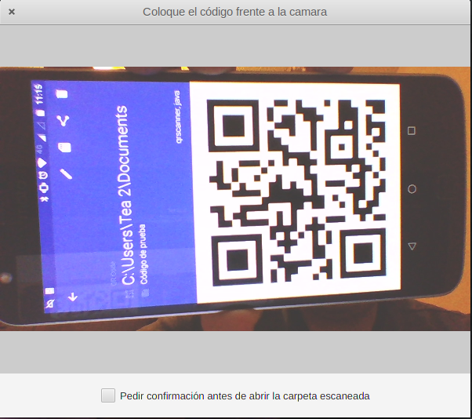

QRScanner
=========
Scan local paths from QR Codes and open it in file explorer.

## Motivation

I started this as an experiment cause I need to share network folders urls
and open it from computer, the idea is simple:
1. You encode the network folder url into a QR code
2. You send qr to you phone
3. Scan the QR on your computer (With this application) and the network folder automatically
will be opened in file browser

## Technology stack
* The UI is build on top of Java FX, so you will need a JRE or JDK
with Java FX included to run it
* The scan is made through ZXing library
* The image acquisition is done through Webcam capture library 
